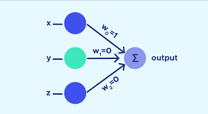
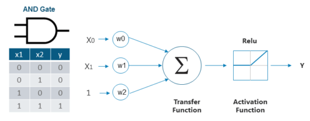

# Perceptron Admission Predictor 🎓🧠

This project is a basic implementation of a **Perceptron model** to simulate the admission process of students into a fictional university based on their performance in **Math** and **Computer Science** exams. It was completed as part of an AI fundamentals workshop.



## 📌 Overview

The task is inspired by a real lab assignment focused on understanding how a single-layer perceptron works from scratch. The model predicts whether a student is admitted or rejected based on two binary inputs:

- **X1**: Passed Math (1 = Yes, 0 = No)
- **X2**: Passed Computer Science (1 = Yes, 0 = No)

The output (Y) is:

- **1**: Admitted
- **0**: Rejected



### 🧮 Dataset

| Math (X1) | CS (X2) | Admitted (Y) |
| --------- | ------- | ------------ |
| 1         | 0       | 0            |
| 1         | 1       | 1            |
| 0         | 1       | 0            |
| 0         | 0       | 0            |

---

## 🧠 How the Perceptron Works

A perceptron is one of the simplest types of artificial neural networks. Here's how this implementation works:

1. **Initialization**:

   - Random weights for inputs and bias, within [-1, 1]
   - Learning rate: 0.1
   - Epochs: 3000

2. **Activation Function**:

   - Sigmoid: `1 / (1 + exp(-x))`

3. **Training Loop**:

   - For each epoch:
     - Predict output using current weights
     - Calculate Mean Squared Error (MSE)
     - Update weights using gradient descent

4. **MSE Tracking**:

   - The model plots the loss curve over training time.

5. **Testing**:
   - Final predictions are made after training for specific inputs, including values like (X1=1, X2=1) and (X1=0, X2=1)

---

## 📊 What You’ll See

- A working single-layer Perceptron from scratch (no frameworks like TensorFlow/PyTorch)
- MSE loss graph to visualize training performance
- Final predictions from trained weights
- Manual function definitions for activation, error, weight updates, etc.

---

## 🚀 Run It Yourself

1. Clone the repo:
   ```bash
   git clone https://github.com/your_username/perceptron-admission-predictor
   cd perceptron-admission-predictor
   ```
2. Open and run the Jupyter Notebook:

   `perceptron-admission-predictor.ipynb`

> Requires: Python 3.8+, numpy, matplotlib, jupyter
